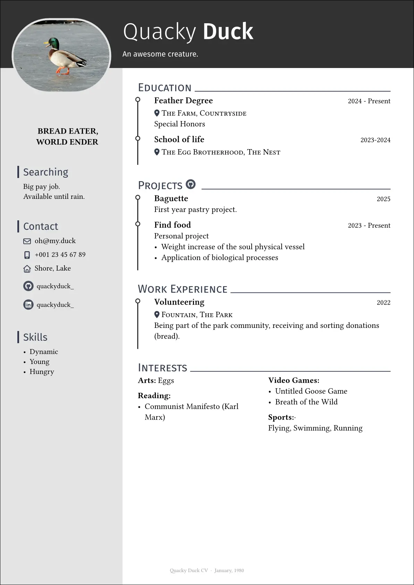

# auto-cv

Another Typst template to generate a resume.
Inspired from [neat-cv](https://github.com/dialvarezs/neat-cv).

## Use

Download `auto-cv.typ` and move it next to your typst file.
```sh
wget https://github.com/beldaphilippe/auto-cv/blob/main/auto-cv.typ
```

Then import the module to use the template.
```typst
#import "auto-cv.typ": *
```

## Examples


